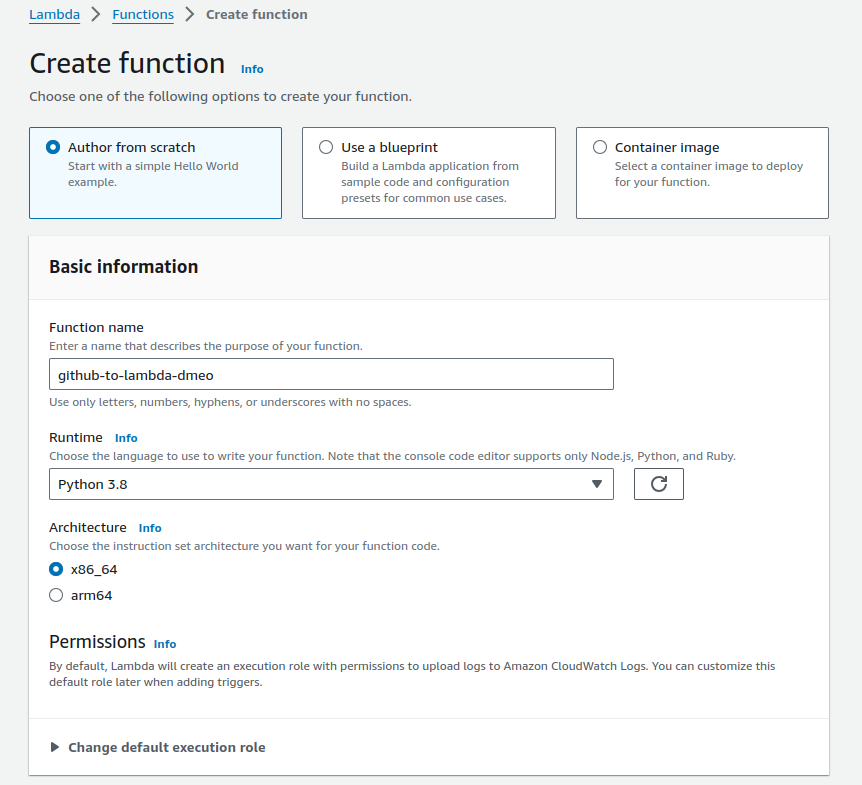
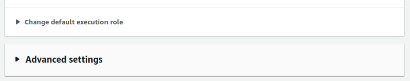
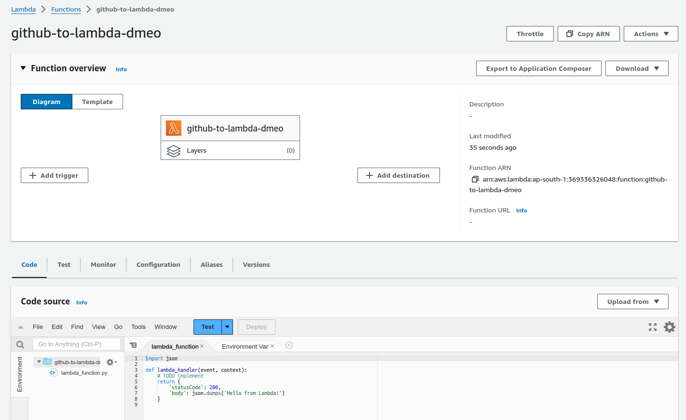
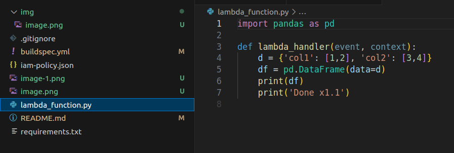

# github-to-lambda-demo

I talk about how to automatically update aws lambda function code using CodeBuild (i.e., CI/CD of AWS Lambda Deployment).

# Create lambda function:

Rest everything as default

Click on `Create function`

After provisioning:

> Function handler in Python

You can tell the `Lambda runtime` which handler method to invoke by setting the handler parameter on your function's configuration.

When you configure a function in Python, the value of the handler setting is the file name and the name of the handler module, separated by a dot. For example, `main.Handler` calls the Handler method defined in `main.py`.

